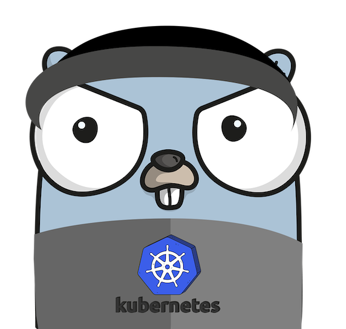

# Software Solutions - Kubernetes Demo

A quick introduction and demonstration of kubernetes

We will cover the following:

- Running kubernetes via docker desktop

- A quick introduction and 101 on Kubernetes

- Building a containerized application for kubernetes

- Deploying a containerized application to kubernetes using skaffold

- Using configmaps

## Next

[Setup kubernetes on Docker Desktop](prereqs.md)

