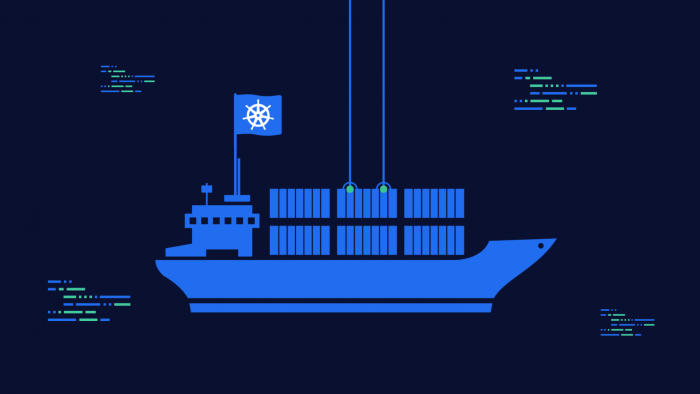
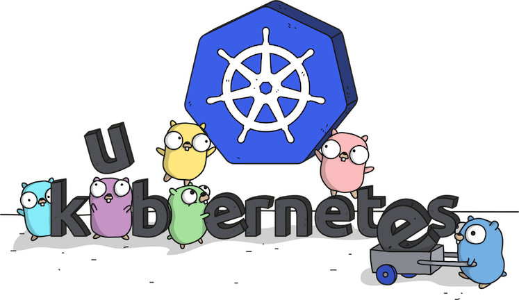

# Why Kubernetes

## What is Kubernetes?

Kubernetes deploys and manages containerized applications. It's primary job is a container orchestrator. Or more precisely, it orchestrates pods. Applications are built from pods. And kubernetes efficiently manages the lifetime, scaling, and networking of pods.

## Cloud Agnostic

Every major cloud provider now provides a managed Kubernetes offering. Thus you can easily create a Kubernetes cluster and deploy your application to multiple cloud providers.

**That's cool, but...** When do I need to deploy to multiple cloud providers? Probably never. But if a client is using (or open to using) Kubernetes and you know Kubernetes, then you know how to deploy your application regardless of cloud provider.

## Velocity

Deploying a new version of an application or updating an application running in Kubernetes is fast and easy

## Easily Assemble a Complete Stack

Use [Helm](https://helm.sh) Charts (and other tools) to deploy databases, middleware, and other components for your application quick and easily.

## Scaling and High Availability

- Efficiently scale horizontally using metrics (cpu, memory, etc)
- Vertical auto-scaling
- High availability architecture

## Repeatable

Because everything is configured in yaml, it is easy to repeat. E.g. create multiple environments

## Next

[k8s 101](k8s-101.md)

